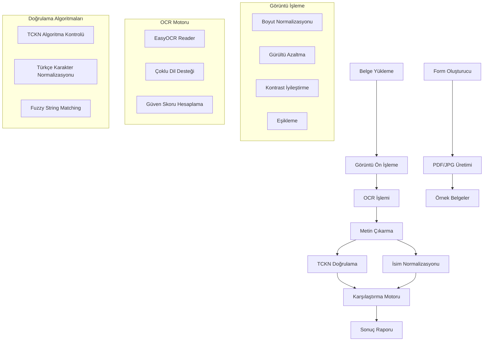

# Validator App - T.C. Kimlik Kartı ve Başvuru Formu Doğrulama Sistemi

T.C. Kimlik Kartı ve başvuru formları arasındaki bilgi tutarlılığını otomatik olarak doğrulayan gelişmiş bir belge doğrulama sistemi. OCR teknolojisi, görüntü işleme algoritmaları ve akıllı string eşleştirme yöntemleri kullanarak yüksek doğruluk oranında belge karşılaştırması gerçekleştirir.

## Detaylı Dokümantasyon
- [Teknik Tasarım ve Mimari](https://github.com/mustafakbaser/Validator-App/blob/main/technical_design_and_architecture.md)
- [Teknoloji ve Kütüphane Seçimi](https://github.com/mustafakbaser/Validator-App/blob/main/tech_stack_and_frameworks.md)
- [Potansiyel İyileştirmeler ve Riskler](https://github.com/mustafakbaser/Validator-App/blob/main/potential_optimizations_and_risks.md)


## Özellikler

- **Çoklu Format Desteği**: JPG, PNG, BMP, TIFF formatlarında belge işleme
- **Gelişmiş OCR Motoru**: EasyOCR tabanlı Türkçe ve İngilizce metin tanıma
- **Akıllı Görüntü Ön İşleme**: Adaptif eşikleme, gürültü azaltma, kontrast iyileştirme
- **Bulanık String Eşleştirme**: RapidFuzz ile Türkçe karakter desteği
- **TCKN Algoritma Doğrulaması**: Matematiksel algoritma ile TC Kimlik Numarası kontrolü
- **Detaylı Raporlama**: Güven skorları ve eşleşme detayları ile şeffaf sonuçlar
- **Örnek Başvuru Form Oluşturma**: ReportLab ile dinamik başvuru formu (PDF) üretimi. (Bu adım, geliştirmeden bağımsız ek özelliktir)

## Sistem Mimarisi



## Kurulum

### Gereksinimler

- Python 3.8+
- OpenCV 4.8+
- EasyOCR 1.7+
- CUDA desteği (opsiyonel, GPU hızlandırma için)

### Kurulum

1. **Repository Klonlama**
   ```bash
   git clone https://github.com/mustafakbaser/Validator-App.git
   cd validator-app
   ```

2. **Bağımlılıkları Yükleme**
   ```bash
   pip install -r requirements.txt
   ```

Ek olarak:

3. **Sanal Ortam Oluşturma** (İsteğe Bağlı)
   ```bash
   python -m venv venv
   source venv/bin/activate  # Linux/Mac
   # veya
   venv\Scripts\activate     # Windows
   ```

4. **OCR Modellerini İndirme**  (Eğer gerekirse)
   ```bash
   python -c "import easyocr; easyocr.Reader(['tr', 'en'])"
   ```

### Docker ile Kurulum

```bash
# Docker image build
docker build -t validator-app:latest .

# Container çalıştırma
docker run -v $(pwd)/input:/app/input -v $(pwd)/output:/app/output validator-app:latest

# Docker Compose ile
docker-compose up -d
```

## Kullanım

### Belge Doğrulama

Kimlik kartı ve başvuru formu arasında bilgi tutarlılığını kontrol etmek için:

```bash
python verify_documents.py application_forms/kimlik_kart.png application_forms/basvuru_formu.jpg
```

Detaylı Doğrulama (--verbose kullanarak):

```bash
python verify_documents.py application_forms/kimlik_kart.png application_forms/basvuru_formu.jpg --verbose
```

**Çıktı Örnekleri:**
- `Olumlu - Tüm bilgiler eşleşiyor`
- `Belgedeki TC Kimlik Numarası Hatalı`
- `Belgedeki Ad Soyad Hatalı`

### Örnek Form Oluşturma

Bu proje özelinde, test amaçlı başvuru formları oluşturmak için bir script oluşturdum, şu şekilde kullanılabilir:

```bash
# Tek form oluşturma
python generate_application_form.py --format both --count 1

# Çoklu form oluşturma
python generate_application_form.py --format pdf --count 5 --output test_form

# Belirli TCKN ile form oluşturma
python generate_application_form.py --tckn 12345678901 --format jpg
```

### Parametreler

| Parametre | Açıklama | Varsayılan |
|-----------|----------|------------|
| `--format` | Çıktı formatı (pdf/jpg/both) | both |
| `--count` | Oluşturulacak form sayısı | 1 |
| `--output` | Çıktı dosya adı | basvuru_formu |
| `--tckn` | Belirli TCKN kullanımı | Rastgele |
| `--verbose` | Detaylı çıktı | False |

## Teknoloji Detayları

### OCR ve Görüntü İşleme

Sistem, EasyOCR tabanlı gelişmiş OCR motoru kullanılarak sistem içindeki belgelerden metin çıkarımı yapılmaktadır. Resim ön işleme adımında:

- **Boyut Normalizasyonu**: Maksimum 4000px boyut sınırı
- **Gürültü Azaltma**: Bilateral filter ile kenar koruyucu filtreleme
- **Kontrast İyileştirme**: CLAHE (Contrast Limited Adaptive Histogram Equalization)
- **Adaptif Eşikleme**: Gaussian adaptif eşikleme algoritması
- **Morfolojik İşlemler**: Açma ve kapatma operasyonları

### String Eşleştirme Algoritması

Bulanık string eşleştirme ve değerlendirme aktivitelerini Türkçe karakter desteği ile birlikte gerçekleştirmek için kullanılan RapidFuzz kütüphanesi kullanıldı:

- **Jaro-Winkler Mesafesi**: Kısa isimler için optimize edilmiş
- **Levenshtein Mesafesi**: Genel amaçlı string benzerliği
- **Token Sort Ratio**: Kelime sırasından bağımsız eşleştirme
- **Partial Ratio**: Alt string eşleştirme

### TCKN Doğrulama Algoritması

T.C. Kimlik Numarası için matematiksel algoritma kontrolü:

1. **Format Kontrolü**: 11 haneli sayısal değer
2. **İlk Hane Kontrolü**: 0 ile başlayamaz
3. **10. Hane Kontrolü**: (1+3+5+7+9)*7 + (2+4+6+8)*9 mod 10
4. **11. Hane Kontrolü**: İlk 10 hanenin toplamı mod 10

## Performans Metrikleri

| Metrik | Değer | Açıklama |
|--------|-------|----------|
| OCR Doğruluk Oranı | %94+ | Türkçe metin tanıma |
| İşlem Süresi | <3 saniye | Standart belge boyutu |
| Bellek Kullanımı | <512MB | Tek belge işleme |
| Desteklenen Format | 6 format | JPG, PNG, BMP, TIFF, PDF |

## Güvenlik ve Gizlilik

- **Veri İşleme**: Yerel işleme, bulut aktarımı yok
- **Geçici Depolama**: İşlem sonrası otomatik temizlik
- **PII Maskeleme**: Log dosyalarında hassas veri gizleme
- **Dosya Doğrulama**: MIME type ve boyut kontrolü

# Teorik Yaklaşımlar

Bu bölüm, teknik tasarım ve mimari dokümanın özeti niteliğindedir. İlgili teorik konulara ait yaklaşımlarıma technical_design_and_architecture.md, tech_stack_and_frameworks.md ve potential_optimizations_and_risks.md dosyalarını inceleyin.

## Teknik Tasarım ve Mimari

Bu bölüm, teknik tasarım ve mimari dokümanın özeti niteliğindedir.

### OCR Stratejisi: Hibrit Yaklaşım

En optimal mimari tasarımım: Sistem, varsayılan olarak Tesseract OCR + OpenCV ile alan-bazlı OCR kullanır. Düşük güven skorunda managed OCR (Google Vision / AWS Textract) fallback mekanizması devreye girer. Bu yaklaşım:

- **Alan-bazlı işleme** ile gürültüyü azaltır
- **ROI (Region of Interest)** tespiti ile doğruluğu artırır
- **Çoklu OCR çalıştırma** ile ensemble yöntemi uygular
- **Confidence tabanlı karar** mekanizması kullanır

### İmza Karşılaştırma Yaklaşımı

#### Faz 1: Bilgisayarlı Görüntü İşleme
- **Ön işleme**: Gri ton, Otsu threshold, morfolojik işlemler
- **Öznitelik çıkarımı**: Kontur uzunluğu, alan doluluk oranı, HOG
- **Lokal öznitelikler**: ORB/SIFT keypoint eşleme
- **Skorlama**: SSIM + global metriklerin ağırlıklı ortalaması

#### Faz 2: Derin Öğrenme (Gelecek)
- **Siamese Network**: Embedding tabanlı benzerlik ölçümü
- **Eşik kalibrasyonu**: ROC/DET eğrisi ile EER minimizasyonu
- **Transfer learning**: Kamu veri setleri ile model eğitimi

### API Geliştirme Stratejisi

**FastAPI** framework'ü tercih edilmiştir:

- **Yüksek performans**: ASGI tabanlı async I/O
- **Otomatik dokümantasyon**: OpenAPI/Swagger entegrasyonu
- **Tip güvenliği**: Pydantic ile veri doğrulama
- **Asenkron iş modeli**: Job-based processing
- **Güvenlik**: OAuth2/OIDC, rate limiting, WAF

## Potansiyel İyileştirmeler ve Riskler

### Mevcut Zayıf Yönler

1. **OCR Doğruluk Sorunları**: Düşük çözünürlüklü belgelerde hata oranı artabilir
2. **İmza Karşılaştırma**: Doğal imza varyasyonları yanlış sonuçlara yol açabilir
3. **Performans**: Yüksek trafik altında darboğaz oluşabilir
4. **Veri Güvenliği**: KVKK/GDPR uyumluluğu sürekli izleme gerektirir

### Risk Azaltma Stratejileri

- **Çoklu OCR Motoru**: Ensemble yöntemleri ile doğruluk artırımı
- **Hibrit İmza Karşılaştırma**: Klasik + derin öğrenme yaklaşımı
- **Performans Optimizasyonu**: GPU hızlandırma, mikroservis mimarisi
- **Güvenlik Katmanları**: AES-256 şifreleme, TLS, RBAC

### Gelecek İyileştirmeler

- **LLM Destekli Doğrulama**: Semantik tutarlılık kontrolü
- **Anomali Tespiti**: Makine öğrenmesi tabanlı şüpheli aktivite tespiti
- **Self-Learning**: Sürekli model iyileştirme
- **Explainable AI**: Şeffaf karar açıklama mekanizmaları