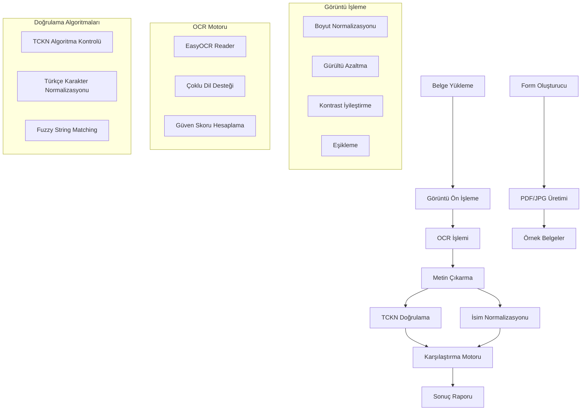

# Validator App - T.C. Kimlik Kartı ve Başvuru Formu Doğrulama Sistemi

T.C. Kimlik Kartı ve başvuru formları arasındaki bilgi tutarlılığını otomatik olarak doğrulayan gelişmiş bir belge doğrulama sistemi. OCR teknolojisi, görüntü işleme algoritmaları ve akıllı string eşleştirme yöntemleri kullanarak yüksek doğruluk oranında belge karşılaştırması gerçekleştirir.

## Özellikler

- **Çoklu Format Desteği**: JPG, PNG, BMP, TIFF formatlarında belge işleme
- **Gelişmiş OCR Motoru**: EasyOCR tabanlı Türkçe ve İngilizce metin tanıma
- **Akıllı Görüntü Ön İşleme**: Adaptif eşikleme, gürültü azaltma, kontrast iyileştirme
- **Bulanık String Eşleştirme**: RapidFuzz ile Türkçe karakter desteği
- **TCKN Algoritma Doğrulaması**: Matematiksel algoritma ile TC Kimlik Numarası kontrolü
- **Detaylı Raporlama**: Güven skorları ve eşleşme detayları ile şeffaf sonuçlar
- **PDF Form Oluşturma**: ReportLab ile dinamik başvuru formu üretimi

## Sistem Mimarisi



## Kurulum

### Gereksinimler

- Python 3.8+
- OpenCV 4.8+
- EasyOCR 1.7+
- CUDA desteği (opsiyonel, GPU hızlandırma için)

### Kurulum

1. **Repository Klonlama**
   ```bash
   git clone https://github.com/mustafakbaser/Validator-App.git
   cd validator-app
   ```

2. **Bağımlılıkları Yükleme**
   ```bash
   pip install -r requirements.txt
   ```

Ek olarak:
3. **Sanal Ortam Oluşturma** (İsteğe Bağlı)
   ```bash
   python -m venv venv
   source venv/bin/activate  # Linux/Mac
   # veya
   venv\Scripts\activate     # Windows
   ```

4. **OCR Modellerini İndirme**  (Eğer gerekirse)
   ```bash
   python -c "import easyocr; easyocr.Reader(['tr', 'en'])"
   ```

### Docker ile Kurulum

```bash
# Docker image build
docker build -t validator-app:latest .

# Container çalıştırma
docker run -v $(pwd)/input:/app/input -v $(pwd)/output:/app/output validator-app:latest

# Docker Compose ile
docker-compose up -d
```

## Kullanım

### Belge Doğrulama

Kimlik kartı ve başvuru formu arasında bilgi tutarlılığını kontrol etmek için:

```bash
python verify_documents.py application_forms/kimlik_kart.png application_forms/basvuru_formu.jpg
```

Detaylı Doğrulama (--verbose kullanarak):

```bash
python verify_documents.py application_forms/kimlik_kart.png application_forms/basvuru_formu.jpg --verbose
```

**Çıktı Örnekleri:**
- `Olumlu - Tüm bilgiler eşleşiyor`
- `Belgedeki TC Kimlik Numarası Hatalı`
- `Belgedeki Ad Soyad Hatalı`

### Örnek Form Oluşturma

Bu proje özelinde, test amaçlı başvuru formları oluşturmak için bir script oluşturdum, şu şekilde kullanılabilir:

```bash
# Tek form oluşturma
python generate_application_form.py --format both --count 1

# Çoklu form oluşturma
python generate_application_form.py --format pdf --count 5 --output test_form

# Belirli TCKN ile form oluşturma
python generate_application_form.py --tckn 12345678901 --format jpg
```

### Parametreler

| Parametre | Açıklama | Varsayılan |
|-----------|----------|------------|
| `--format` | Çıktı formatı (pdf/jpg/both) | both |
| `--count` | Oluşturulacak form sayısı | 1 |
| `--output` | Çıktı dosya adı | basvuru_formu |
| `--tckn` | Belirli TCKN kullanımı | Rastgele |
| `--verbose` | Detaylı çıktı | False |
