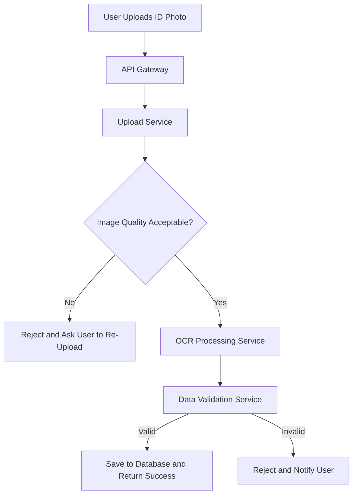
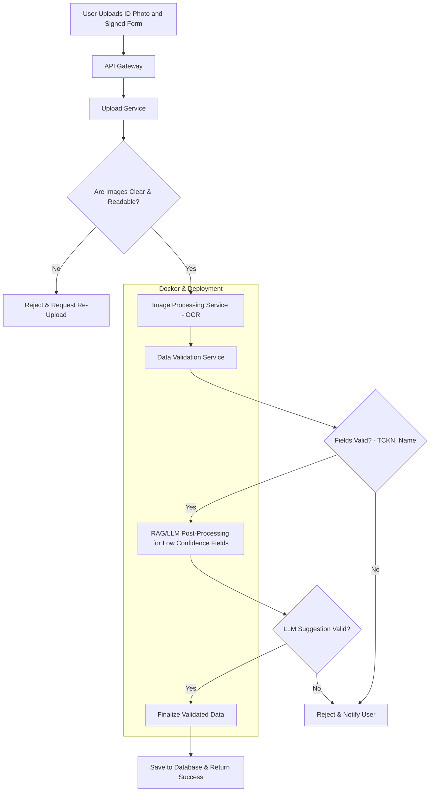

# 1. Teknik Tasarım ve Mimari

Bu bölümde, sistemin temel mimarisini, bileşenlerini ve iletişim akışını detaylı şekilde açıklayacağım. Amaç, yalnızca çalışır bir PoC (Proof of Concept) değil, ölçeklenebilir, güvenli, sürdürülebilir bir sistem mimarisi oluşturmaktır.

---

## Mimari Tercihi: Mikroservis Mimarisi

Proje mimarisi tercihim mikroservis tabanlı olacak.

- **Ölçeklenebilirlik:**  Görüntü işleme, kullanıcı doğrulama, kimlik analizi ve API yönetimi gibi farklı işlevler ayrı ayrı ölçeklenebilir. Örneğin, yoğun trafik anlarında görüntü işleme servisleri yalnızca görüntü işleme servisleri yatayda genişletilebilir. 
- **Bakım Kolaylığı:** Servisler bağımsız modüller olup, ayrı ayrı geliştirilip test edilip güncellenebilmektedir. Böylece herhangi bir servis üzerinde yapılacak değişiklik tüm sistemi etkilemeyecek şekilde servis bağımsızlığı vardır.
- **Güvenlik ve İzolasyon:** Kullanıcı verilerini işleyen kritik servisler (TCKN - başvuru formu doğrulama modülü gibi) kritik servisler izole edilebileceğinden ek güvenlik katmanları eklenebilir.
- **Teknoloji Bağımsızlığı:** Görüntü işleme Python tabanlı OpenCV veya PyTorch ile yapılırken, API katmanı Node.js veya Go ile geliştirilebilir. Her iş yükü için en iyi teknolojiyi seçme serbestliği sağlar. 

Alternatif olarak monolitik bir yapı daha hızlı geliştirme fırsatı sunar ama uzun dönemde bakım, güvenlik riskleri barındırır. Böyle bir senaryoda, proje ölçeklenebilir ve kurumsal standartlarda bir ürün haline getirilecekse mikroservis mimarisi en doğru tercih olacak.

---

## Ana Bileşenler ve Haberleşme Yapısı

Sistemin temel bileşenleri şunlardan oluşacaktır:

1. **API Gateway**
   - Tüm istemci isteklerinin giriş noktası.
   - Rate limiting, authentication (JWT, OAuth2), request validation ve logging gibi cross-cutting concerns burada ele alınır.

2. **Kullanıcı Yükleme Servisi**
   - Kullanıcının kimlik fotoğrafını yüklediği servis.
   - Yüklenen fotoğraf **ilk validasyon** aşamasından geçirilir: çözünürlük, bulanıklık, okunabilirlik.
   - Eğer görsel net değilse, sistem yüklemeyi reddeder ve kullanıcıdan yeniden yükleme ister.  
     *(Burada önerim, kullanıcıya gerçek zamanlı geri bildirim vererek daha iyi deneyim sunmak.)*

3. **Görüntü İşleme Servisi**
   - OCR (Optical Character Recognition) ile kimlik üzerindeki TCKN ve ad-soyad bilgileri çıkarılır. (Mevcut PoC seviyesinde geliştirdiğim projede olduğu gibi)
   - Görsel eksikliği, bulanık (blurlanmış), yamuk ya da eksik olan görseller için ön işleme (ör. contrast adjustment, denoising, thresholding) işlemleri uygulanır.
   -  ML/AI destekli kalite kontrol algoritmaları uygulamak mümkündür.

4. **Veri Doğrulama Servisi**
   - OCR’dan elde edilen TCKN ve isim bilgileri doğrulanır.
   - Gerekirse NVI (Türkiye Cumhuriyeti Nüfus ve Vatandaşlık İşleri) API veya kurumsal mock doğrulama servisleriyle çapraz kontrol yapılır.

5. **Database**
   - Kullanıcı bilgileri, işlem kayıtları ve oturum açma bilgileri güvenli bir şekilde saklanır. - Kritik bilgiler için field-level encryption kullanılmalıdır.
   - GDPR veya KVKK’ye uyum açısından sadece gerekli veriler saklanır. 

6. **Monitoring & Logging**
   - ALK servisleri Prometheus + Grafana veya ELK stack ile izlenmektedir. 
   - Güvenlik logları ile, anormal işlemler (örneğin bir kullanıcının kısa bir süre içinde çok sayıda yükseltme işlemi yapması) loglanmaktadır.

---

## Servisler Arası Haberleşme

- **API Gateway → Servisler:** HTTP/REST veya gRPC üzerinden iletişim gerçekleşir. En yüksek performans için gRPC daha uygundur.
- **Asenkron İletişim:** RabbitMQ/Kafka gibi bir kuyruklama sistemleri yoğun iş yükü olan işler için (örneğin OCR) asenkron iletişim kullanabilmektedir. Bu sayede iş kuyruğu yönetilebilir ve sistem çökme riski azalır.
- **Servis Keşfi:** Mikroservislerin ölçeklenebilir yapılarını yönetmek amacıyla Service Discovery mekanizması Kubernetes üzerinde kurulur.

---

## Docker Kullanımı

Docker, projenin merkezinde yer alır:

- **Her servis için ayrı Docker image:** Her servis ayrı containerda çalıştığı için sistemi kapsayıcı olarak ele alabilmek için, API container, OCR servisi container, ve doğrulama servisi container ayrı ayrı çalıştırılır.
- **Ortam Tutarlılığı:** Geliştirme, test ve prod ortamlarda containerlar veri güvenliğini sağlamak amacıyla sanal ortamlarda aynı anda çalıştırılarak "benim bilgisayarımda çalışıyordu"  sorunlarını ortadan kaldırılır.
- **Docker Compose & Kubernetes:** İlk aşamada Docker Compose ile servislerin orkestrasyonu yapılabilir. Daha ileri aşamada Kubernetes’e geçilerek **auto-scaling, service mesh (Istio), config management (ConfigMap/Secrets)** gibi enterprise özelliklerden yararlanılır.
- **Security Best Practices:** Docker image’leri için Alpine tabanlı minimal imajlar kullanılmalı, gereksiz paketler kaldırılmalı, root olmayan kullanıcılarla çalıştırılmalıdır.

---

## Örnek Akış Şeması

## Geniş Kapsamlı Hazırladığım Akış Şeması

## Sonuç

Bu tasarım, sektör en iyi uygulamalarına uygun olarak esnek, güvenli, ve ölçeklenebilir bir mimari sağlar. Mikroservis tabanlı ayrıştırma ile bileşenlerin bağımsız çalışabilmesi hem performans hem de güvenlik için izolasyon sağlar. Docker ve container tabanlı container yönetimi ile, geliştirme, test ve üretim aşamalarında tutarlılık ve taşınabilirlik sağlayarak sürdürülebilirliği ve oprasyonel verimliliği artırır. Kullanıcı deneyimi açısından, kötü veya okunaksız görsellerin otomatik reddi, anlık kullanıcı geri bildirimleri, ve RAG/LLM destekli alan doğrulamaları sistemin doğruluk oranını artıracaktır. Ayrıca, bu sistem gelecekte yeni belge türleri, ek güvenlik özellikleri ya da yeni doğrulama algoritmaları ile kolayca entegre edilebilecek biçimde tasarlanmıştır.